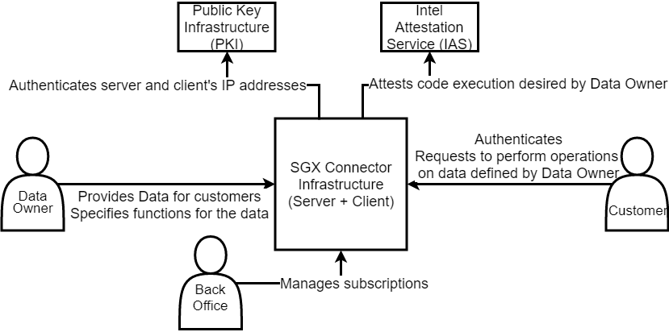
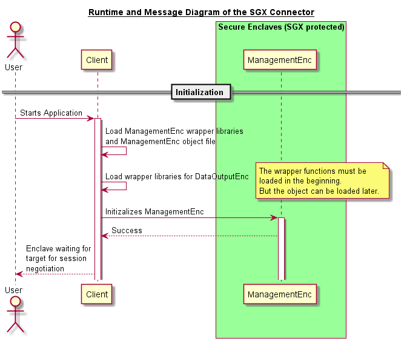
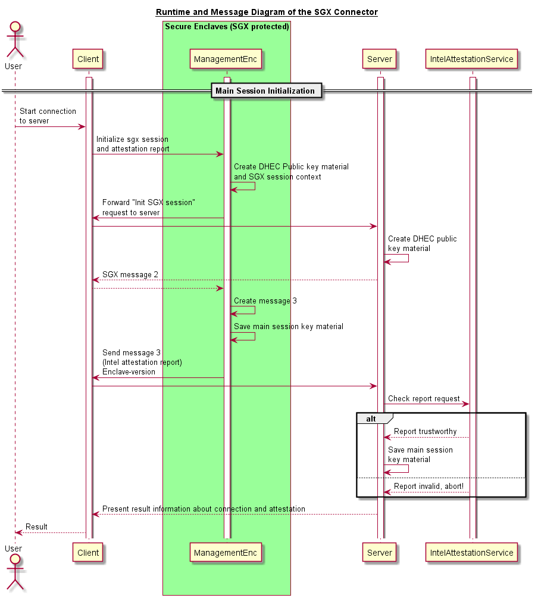
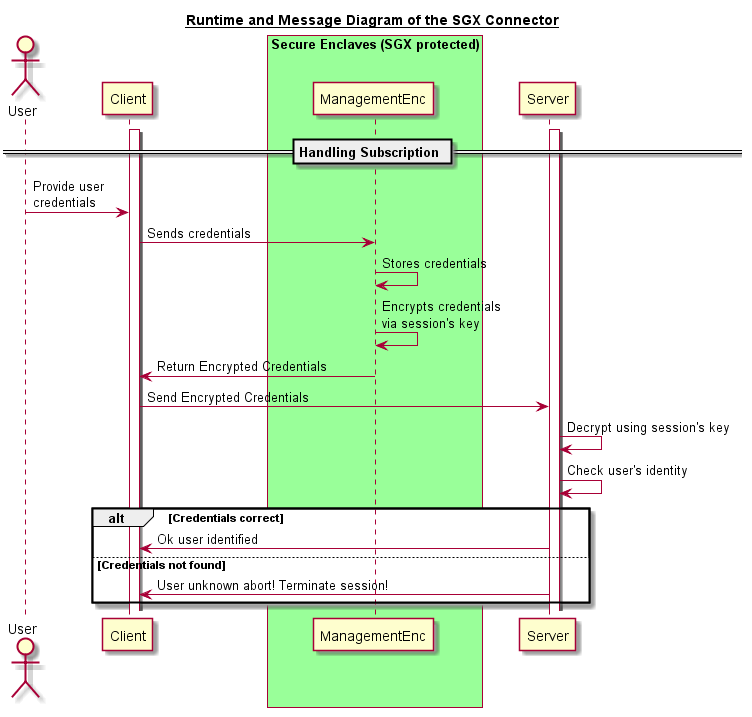
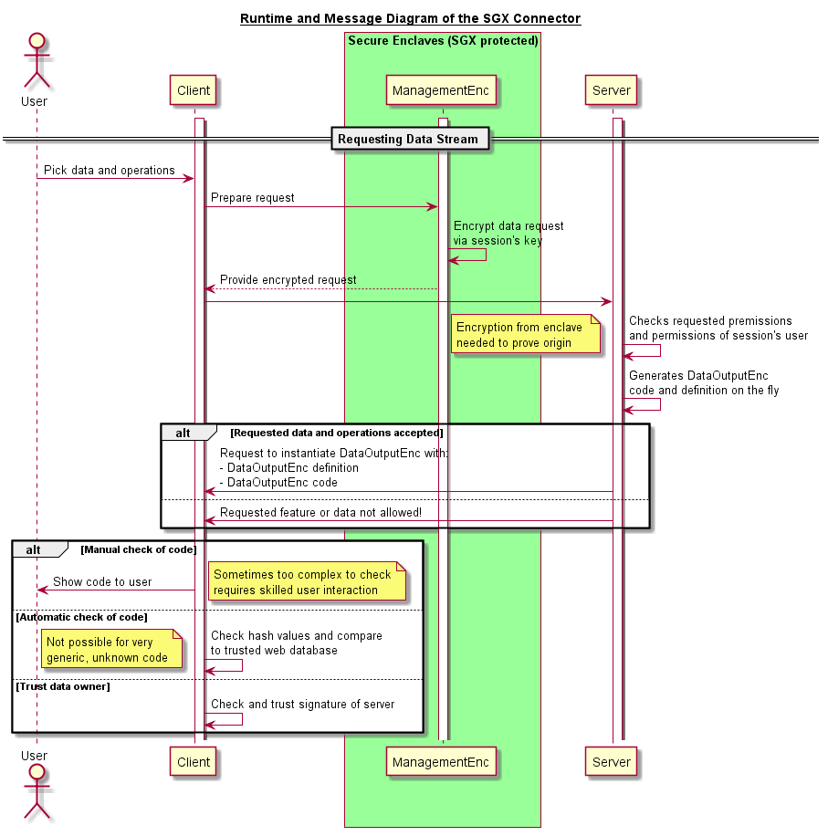
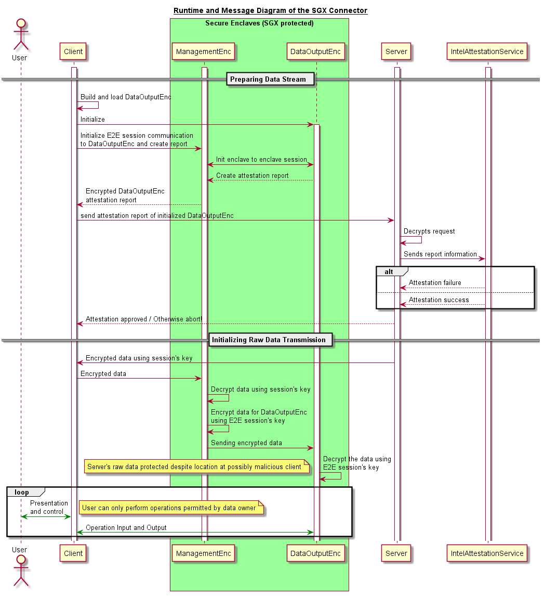

# MECT Proof-of-Concept

This is a repository for the conference paper:
Securing Remote Policy Enforcement by a Multi-Enclave based Attestation Architecture

It contains: 
- A small proof-of-concept implementation for an automated enclave generation service
- Documentation (explanations, screencasts, sequence diagrams)
- Building Instructions

It is built using:
- The official Intel SGX remote attestation sample (https://github.com/intel/sgx-ra-sample)
- The official Intel SGX sample sdk with local enclave to enclave function call handlings (https://github.com/intel/linux-sgx/tree/master/SampleCode)
- Some minor additional logic explained in the corresponding paper

The technical readiness level (TRL) is very low. The aim of the poc is only to gain further practical insights in the properties addressed in the paper and NOT a system which is ready for a production environment. 

## Building Instructions

- Follow the instructions from the original Intel remote attestation sample at https://github.com/intel/sgx-ra-sample.
- You will need a registered ID for the Intel Attestation Service (IAS) which can be acquired following the original manual.
- Once you made sure, that your SGX-SDK for Linux and the SGX-driver are runnning correctly you can build this project.
- "cd intel-sgx-ias-prototype"
- "make clean install"

## Documentation 

This section details some additional overview, sequence diagrams and context overviews concerning the concept MECT.

### Concept Overview

#### Context View

#### Building Block View

### Screencasts

### Sequence Diagrams

#### Initialisation of enclaves

#### Main session initialisation

#### Handling subscription

#### Requesting data stream

#### Initialising data stream

